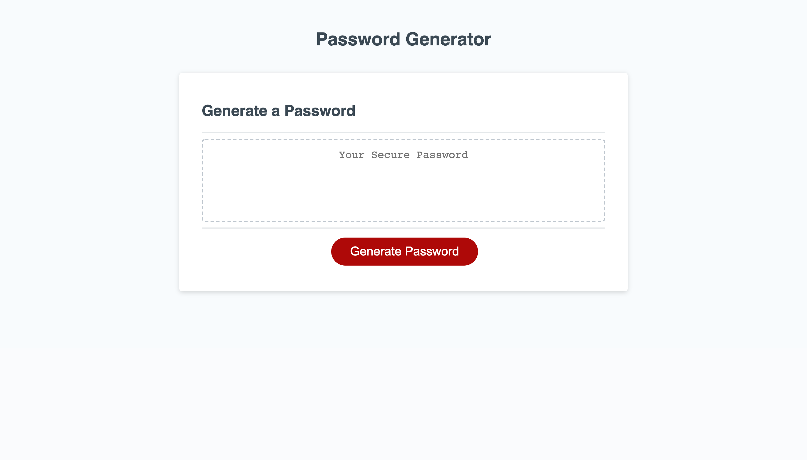

<h1>PASSWORD GENERATOR ASSIGNMENT</h1>

<h2>Purpose</h2>

Deploy a functional responsive password generator with intuitive User Interface

<h2>Coding Languages used</h2>

  <ul>
    <li> HTML </li>
    <li> CSS </li>
    <li> JAVASCRIPT </li>
  </ul>

<h2>Web Application URL</h2>
<a href="https://walterego95.github.io/password-generator-assignment/">(Walter Scimone Password Generator)</a>

<h2>Landing Web App Image</h2>

<footer>
  <h2>Contribution</h2>
  
Made with ❤️️ by Walter Scimone

    </footer>
